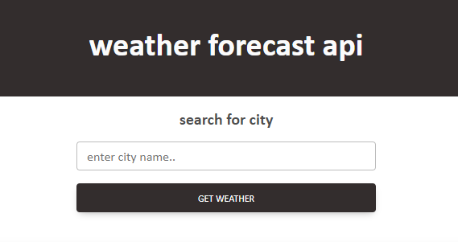

# 06 Server-Side APIs: Weather Dashboard Challenge


## Overview


* The weather dashboard will dynamically update HTML and CSS upon searching for city. 

* Using a [Five Day Forecast API](https:/openweathermap.org/forecast5) to retrieve weather data from [OpenWeatherMap](https://openweathermap.org/) 

* Uses `localStorage` and `JSON` methods to store and retrieve data.


## Specific Goals

```

Searched city will present current & future weather conditions aswell as save search history

OpenWeatherMap API to get following weather data:
  
  city name 
  date 
  icon representation of weather conditions 
  temperature
  humidity
  wind speed

Selecting city from history will present current and future weather conditions 

```


## Example Preview




## Deployment

* GitHub [Pages URL](https://seanwsutter.github.io/06-serverapi-challenge-sws/)

* Github [Repository](https://github.com/seanwsutter/06-serverapi-challenge-sws/)


